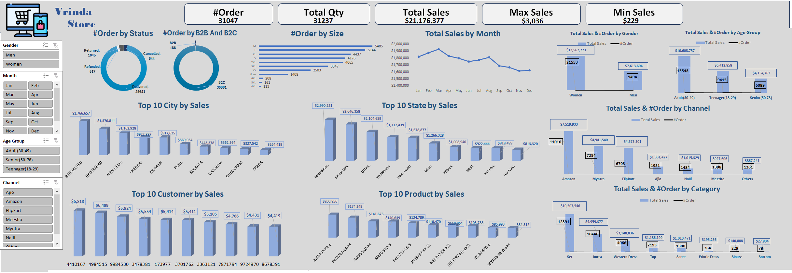

# Vrinda Store Dashboard

## Overview
The **Vrinda Store Dashboard** is an interactive sales analysis dashboard built using Microsoft Excel. It provides key insights into orders, sales, customer behavior, and product performance. The dashboard allows businesses to track sales trends, order statuses, and customer demographics for better decision-making.

## Features
- **Order Analysis**: Displays total orders, order statuses (delivered, refunded, canceled, etc.), and order breakdown by B2B and B2C.
- **Sales Insights**: Highlights total sales, maximum and minimum sales, and total quantity sold.
- **Demographic Breakdown**: Sales and order distribution based on gender, age group, and location (cities and states).
- **Channel Performance**: Sales and order distribution across various online marketplaces like Amazon, Myntra, Flipkart, etc.
- **Product Performance**: Top-selling products and sales by product category.
- **Monthly Trends**: Sales trends across different months to identify peak sales periods.

## Charts Included
- **Order by Status**: Pie chart showing the proportion of delivered, returned, refunded, and canceled orders.
- **Order by B2B & B2C**: Pie chart showing the share of B2B vs. B2C orders.
- **Order by Size**: Bar chart showing distribution of orders by size categories (S, M, L, XL, etc.).
- **Total Sales by Month**: Line chart tracking monthly sales trends.
- **Top 10 Cities & States by Sales**: Bar charts displaying the highest revenue-generating locations.
- **Total Sales & Orders by Gender and Age Group**: Comparative bar charts to analyze customer demographics.
- **Total Sales & Orders by Channel**: Bar chart showcasing sales from different platforms.
- **Total Sales & Orders by Category**: Breakdown of sales by clothing category (Sets, Western Dresses, Sarees, etc.).
- **Top 10 Products & Customers by Sales**: Identifies high-performing products and valuable customers.

## Key Insights
1. **Women customers contribute more to total sales ($13.5M) compared to men ($7.6M).**
2. **The highest revenue-generating city is Bengaluru ($1.76M), followed by Hyderabad and New Delhi.**
3. **Maharashtra tops state-wise sales ($2.99M), followed by Karnataka and Uttar Pradesh.**
4. **Amazon is the top-performing channel with $7.5M in sales, followed by Myntra ($4.9M).**
5. **The best-selling product is JNE2979K-L ($200,856 in sales).**
6. **Sets contribute the highest category-wise sales ($10.5M), followed by Kurtas ($4.9M).**

## Screenshot

## Conclusion
The **Vrinda Store Dashboard** provides valuable insights into sales and order trends. It helps businesses identify top-performing locations, customer segments, and sales channels, allowing for data-driven decision-making. By leveraging these insights, Vrinda Store can optimize inventory, improve marketing strategies, and enhance customer experience.

